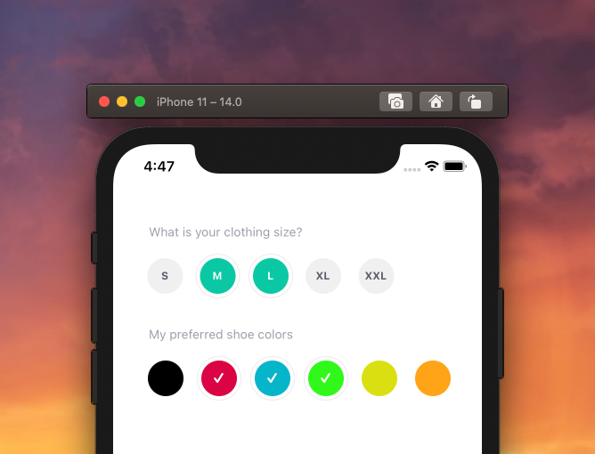

[](https://github.com/WrathChaos/react-native-rounded-checkbox)

[](https://www.npmjs.com/package/react-native-rounded-checkbox)
[](https://www.npmjs.com/package/react-native-rounded-checkbox)

[](https://opensource.org/licenses/MIT)
[](https://github.com/prettier/prettier)

<p align="center">
  
  
</p>

# Installation

Add the dependency:

```bash
npm i react-native-rounded-checkbox
```

## Peer Dependencies

<h5><i>IMPORTANT! You need install them</i></h5>

```js
"@freakycoder/react-native-bounceable": ">= 0.1.1"
```

# Usage

## Import

```jsx
import {
  RoundedCheckbox,
  PureRoundedCheckbox,
} from "react-native-rounded-checkbox";
```

## Fundamental Usage

```jsx
<RoundedCheckbox onPress={(checked) => console.log("Checked: ", checked)} />
```

## PureComponent Usage

```jsx
<PureRoundedCheckbox onPress={(checked) => console.log("Checked: ", checked)} />
```

# Configuration - Props

| Property           |   Type    |  Default  | Description                                                                                             |
| ------------------ | :-------: | :-------: | ------------------------------------------------------------------------------------------------------- |
| onPress            | function  | undefined | set your own onPress functionality                                                                      |
| active             |  boolean  | undefined | disables the built-in check system and it let's to control check system                                 |
| children           | component |   Text    | change the default Text component with any component like `Icon` from react-native-dynamic-vector-icons |
| text               |  string   |    "L"    | change the default text value                                                                           |
| isChecked          |  boolean  |   false   | set the initial checked state                                                                           |
| checkedColor       |   color   |  #0bc8a5  | change the background color when checked state is true                                                  |
| uncheckedColor     |   color   |  #f0f0f0  | change the background color when checked state is false                                                 |
| checkedTextColor   |   color   |  #fdfdfd  | change the text color when checked state is true                                                        |
| uncheckedTextColor |   color   |  #5c5969  | change the text color when checked state is false                                                       |
| textStyle          |   style   |  default  | set your own `text` style instead of default one                                                        |
| outerStyle         |   style   |  default  | set your own `outer` style instead of default one                                                       |
| innerStyle         |   style   |  default  | set your own `inner` style instead of default one                                                       |

## Future Plans

- [x] ~~LICENSE~~
- [ ] Write an article about the lib on Medium

## Credits

Heavily inspired by [William Candillon's Youtube Series](https://www.youtube.com/watch?v=2hveuwFtVZ0)

## Author

FreakyCoder, kurayogun@gmail.com

## License

React Native Rounded Checkbox is available under the MIT license. See the LICENSE file for more info.
